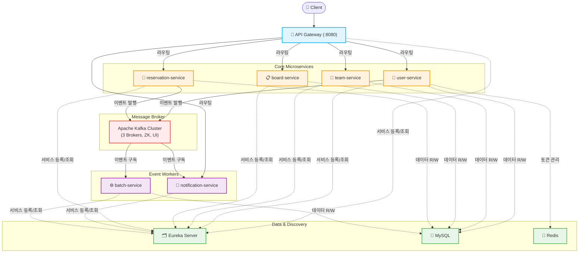

# Crane Web Backend v3 (🚧작성중🚧)

> 크레인 웹 서비스의 백엔드 시스템 — MSA(마이크로서비스 아키텍처) 기반 v3

---

## 📋 목차

1. [프로젝트 설명](#1-프로젝트-설명)
2. [개발자 정보](#2-개발자-정보)
3. [기술 스택](#3-기술-스택)
4. [아키텍처 다이어그램](#4-아키텍처-다이어그램)
5. [프로젝트 데모](#5-프로젝트-데모)
6. [프로젝트 구성](#6-프로젝트-구성)
   - [서비스별 역할](#서비스별-역할)
   - [설계 특이사항](#설계-특이사항)
   - [구현 방법](#구현-방법)
7. [설치 및 실행 방법](#7-설치-및-실행-방법)
   - [사전 요구사항](#사전-요구사항)
   - [환경 변수 설정](#환경-변수-설정)
   - [실행 방법](#실행-방법)
8. [API 명세](#8-api-명세)
9. [저작권 및 사용권 정보](#9-저작권-및-사용권-정보)
10. [참고 및 출처](#10-참고-및-출처)
11. [버전 및 업데이트 정보](#11-버전-및-업데이트-정보)
12. [FAQ](#12-faq)

---

## 1. 프로젝트 설명

> 밴드동아리([CRANE](https://www.instagram.com/crane__sch/)) 내부적으로 반복 수기 작업하던 예약 과정을 자동화하여, 웹 사이트를 제작한 서비스.

- BE 2인, FE 1인이 진행 (2024.06 ~ 2025.01, 2026년 2월까지 약 18개월 운영)
- 18개월간 사용자 약 190명, 예약 약 1,700건
- 멘토링을 위한 장비·공간 예약, 합주를 위한 공간 예약, 동아리 활동 기록을 위한 게시판, 팀 관리 기능 구현

기존 모놀리식 구조에서 MSA로 전환한 버전으로, 각 도메인(사용자, 팀, 게시판, 예약, 알림 등)을 독립적인 서비스로 분리하여 높은 확장성과 유지보수성을 확보했습니다. 서비스 간 통신은 **Apache Kafka** 이벤트 스트리밍을 중심으로 구성되며, **Spring Cloud Netflix Eureka** 를 통해 서비스 디스커버리를 처리합니다.

**주요 기능:**
- 사용자 인증 및 권한 관리 (JWT + Spring Security)
- 팀 생성 및 관리
- 게시판 CRUD
- 예약 시스템
- 실시간 알림 (Kafka 기반 이벤트)
- 배치 처리 자동화 (예약 일괄 생성)

---

## 2. 개발자 정보

| 이름 | 역할 | GitHub |
|------|------|--------|
| [명혜성] | [기획, 백엔드(예약, 회원 등 기능), 프론트엔드 전체] | [@Hyeseong-Myeong](https://github.com/Hyeseong-Myeong) |
| [송예림] | [백엔드(알림, 게시판 등 기능)] | [@Yearm404](https://github.com/YerimSong404) |

---

## 3. 기술 스택

### Backend
| 분류 | 기술 |
|------|------|
| Language | Java 17 |
| Framework | Spring Boot 3.3.5 |
| Build Tool | Gradle |
| ORM | Spring Data JPA |
| Security | Spring Security, JWT (jjwt 0.11.5), BCrypt |

### Database & Cache
| 분류 | 기술 |
|------|------|
| RDBMS | MySQL |
| Cache | Redis |

### Messaging
| 분류 | 기술 |
|------|------|
| Message Broker | Apache Kafka (3-broker 클러스터) |
| Coordinator | Apache Zookeeper |
| Kafka UI | Kafka-UI (provectuslabs) |

### Infrastructure & MSA
| 분류 | 기술 |
|------|------|
| Service Discovery | Spring Cloud Netflix Eureka |
| API Gateway | Spring Cloud Gateway |
| Container | Docker, Docker Compose |

---

## 4. 아키텍처 다이어그램



---

## 5. 프로젝트 데모

> 추후 추가 예정

---

## 6. 프로젝트 구성

### 서비스별 역할

| 서비스 | 디렉토리 | 설명 |
|--------|----------|------|
| API Gateway | `api-gateway/` | 모든 외부 요청의 단일 진입점. 라우팅 및 인증 필터 처리 |
| Eureka Server | `eureka-server/` | 서비스 레지스트리. 각 마이크로서비스의 위치(host:port)를 등록·조회 |
| User Service | `user-service/` | 인증, 인가 서비스 (회원가입, 로그인, JWT 발급·검증, 사용자 정보 관리) |
| Team Service | `team-service/` | 팀 생성, 수정, 삭제 및 팀원 관리 |
| Board Service | `board-service/` | 게시글 및 댓글 CRUD |
| Reservation Service | `reservation-service/` | 예약 생성, 조회, 변경, 취소 |
| Notification Service | `notification-service/` | Kafka Consumer로 이벤트를 구독하여 알림 발송 |
| Batch Service | `batch-service/` | Kafka Consumer로 이벤트를 구독하여 예약 데이터를 DB에 일괄 생성 |

### 설계 특이사항

**1. MSA 전환 (v2 → v3)**
기존 단일 애플리케이션 구조에서 도메인별 독립 서비스로 분리했습니다. 각 서비스는 독립적으로 배포·확장 가능합니다.

**2. Kafka 3-Broker 클러스터**
단일 브로커 대비 내결함성(Fault Tolerance)을 확보합니다. 브로커 한 개가 다운되더라도 나머지 브로커가 메시지 처리를 이어받습니다. `docker-compose.yml` 설정 기준으로 `kafka1`, `kafka2`, `kafka3` 세 개의 브로커가 구성됩니다.

**3. JWT 기반 Stateless 인증**
Redis를 활용한 토큰 블랙리스트 관리로 로그아웃 처리를 구현합니다. API Gateway 레벨에서 토큰 검증을 수행하여 각 서비스의 중복 검증을 최소화합니다.

**4. 서비스 간 통신 전략**
- 동기 통신: Spring Cloud Gateway를 통한 REST 라우팅
- 비동기 통신: Kafka 이벤트 기반 (예: 예약 완료 → Notification Service 알림 발행, Batch Service 일괄 저장)

### 구현 방법

```
Crane_Web_Backend_v3/
├── .github/                  # GitHub Actions CI/CD 워크플로우
├── api-gateway/              # Spring Cloud Gateway
├── batch-service/            # 예약 일괄 생성 배치
├── board-service/            # 게시판 도메인
├── eureka-server/            # Netflix Eureka Server
├── notification-service/     # 알림 도메인
├── reservation-service/      # 예약 도메인
├── team-service/             # 팀 도메인
├── user-service/             # 사용자/인증 도메인
├── gradle/wrapper/
├── build.gradle              # 공통 의존성 정의
├── settings.gradle
└── docker-compose.yml        # Kafka 클러스터 + Zookeeper + Kafka-UI
```

각 서비스는 독립적인 `build.gradle`을 가지며, 루트의 `build.gradle`에서 공통 의존성(JPA, Redis, Security, JWT 등)을 관리합니다.

---

## 7. 설치 및 실행 방법

### 사전 요구사항

| 항목 | 버전 |
|------|------|
| JDK | 17 이상 |
| Docker | 20.x 이상 |
| Docker Compose | 2.x 이상 |
| MySQL | 8.x |

### 환경 변수 설정

프로젝트 루트에 `.env` 파일을 생성하고 아래 항목을 설정합니다.

```env
# Kafka 외부 접속용 호스트 IP (docker-compose.yml에서 사용)
HOST_IP=127.0.0.1

# MySQL
MYSQL_HOST=localhost
MYSQL_PORT=3306
MYSQL_DATABASE=crane_db
MYSQL_USERNAME=your_db_user
MYSQL_PASSWORD=your_db_password

# Redis
REDIS_HOST=localhost
REDIS_PORT=6379

# JWT
JWT_SECRET=your_jwt_secret_key_here
JWT_EXPIRATION=3600000

# Eureka
EUREKA_SERVER_URL=http://localhost:8761/eureka
```

각 서비스의 `application.yml`에서 추가적인 설정이 필요할 수 있습니다. 각 서비스 디렉토리 내 `src/main/resources/application.yml`을 참고하세요.

### 실행 방법

**1단계: 저장소 클론**
```bash
git clone https://github.com/CraneWebProject/Crane_Web_Backend_v3.git
cd Crane_Web_Backend_v3
git checkout msa
```

**2단계: Kafka 클러스터 실행 (Docker Compose)**
```bash
docker-compose up -d
```

실행 후 Kafka UI는 `http://localhost:8989` 에서 확인할 수 있습니다.

**3단계: 서비스 빌드**
```bash
./gradlew build
```

**4단계: 서비스 실행 (순서 중요)**

Eureka Server → 각 마이크로서비스 → API Gateway 순으로 실행합니다.

```bash
# 1. Eureka Server 먼저 실행
cd eureka-server
../gradlew bootRun &

# 2. 각 마이크로서비스 실행 (별도 터미널)
cd user-service && ../gradlew bootRun
cd team-service && ../gradlew bootRun
cd board-service && ../gradlew bootRun
cd reservation-service && ../gradlew bootRun
cd notification-service && ../gradlew bootRun
cd batch-service && ../gradlew bootRun

# 3. API Gateway 마지막에 실행
cd api-gateway && ../gradlew bootRun
```

**실행 확인**
- Eureka Dashboard: `http://localhost:8761`
- API Gateway: `http://localhost:8080`
- Kafka UI: `http://localhost:8989`

---

## 8. API 명세


```
API 문서: 
```

주요 엔드포인트 요약:

| 메서드 | 경로 | 설명 | 서비스 |
|--------|------|------|--------|
| POST | `/api/users/signup` | 회원가입 | user-service |
| POST | `/api/users/login` | 로그인 (JWT 발급) | user-service |
| GET | `/api/teams/{teamId}` | 팀 정보 조회 | team-service |
| POST | `/api/boards` | 게시글 작성 | board-service |
| POST | `/api/reservations` | 예약 생성 | reservation-service |

> 상세 요청/응답 스펙은 각 서비스의 API 문서를 참고하세요.

---

## 9. 저작권 및 사용권 정보

```
Copyright (c) 2024 CraneWebProject
```

본 프로젝트는 **MIT License** 하에 배포됩니다. 자세한 내용은 [LICENSE](./LICENSE) 파일을 참고하세요.

---


## 10. 참고 및 출처

- [Spring Cloud 공식 문서](https://spring.io/projects/spring-cloud)
- [Apache Kafka 공식 문서](https://kafka.apache.org/documentation/)
- [Spring Security + JWT 가이드](https://docs.spring.io/spring-security/reference/)
- [Netflix Eureka GitHub](https://github.com/Netflix/eureka)
- [Kafka UI (provectuslabs)](https://github.com/provectus/kafka-ui)

---

## 11. 버전 및 업데이트 정보

| 버전 | 날짜 | 내용 |
|------|------|------|
| v3.0.0 | 2025/01 | MSA 구조로 전면 재설계. Kafka, Eureka, API Gateway 도입 |
| v2.x.x | 2024/11 | 초기 모놀리식 버전 |
| v1.x.x | 2024/06 | 최초 버전 |

> 세부 변경 이력은 [커밋 히스토리](https://github.com/CraneWebProject/Crane_Web_Backend_v3/commits/msa)를 참고하세요.

---

## 12. FAQ

**Q. 서비스 실행 순서가 왜 중요한가요?**
> Eureka Server가 먼저 실행되어야 다른 서비스들이 자신의 위치를 등록할 수 있습니다. API Gateway는 등록된 서비스 목록을 기반으로 라우팅하므로 마지막에 실행해야 정상 동작합니다.

**Q. `HOST_IP` 환경 변수는 왜 필요한가요?**
> Kafka 브로커가 외부(컨테이너 밖)에서 접근 가능하도록 `EXTERNAL` 리스너에 실제 호스트 IP를 명시해야 합니다. 로컬 환경에서는 `127.0.0.1`로 설정하면 됩니다.

**Q. 각 서비스마다 DB를 따로 만들어야 하나요?**
> MSA 원칙상 서비스별 독립 DB를 권장합니다. 현재 구성은 MySQL을 사용하며, 서비스별 스키마(데이터베이스)를 분리하는 방식을 사용합니다. 각 서비스의 `application.yml`에서 데이터소스를 확인하세요.

**Q. Kafka UI는 어떻게 접근하나요?**
> `docker-compose up` 실행 후 브라우저에서 `http://localhost:8989`로 접근할 수 있습니다. 토픽 생성, 메시지 모니터링 등을 GUI로 확인할 수 있습니다.

**Q. 로컬 실행 시 JWT 인증이 계속 실패합니다.**
> `.env` 또는 `application.yml`의 `JWT_SECRET` 값이 모든 서비스에서 동일하게 설정되어 있는지 확인하세요. User Service에서 발급한 토큰은 API Gateway에서도 동일한 키로 검증합니다.

---

<div align="center">

**Crane Web Project** · [GitHub Organization](https://github.com/CraneWebProject)

</div>
