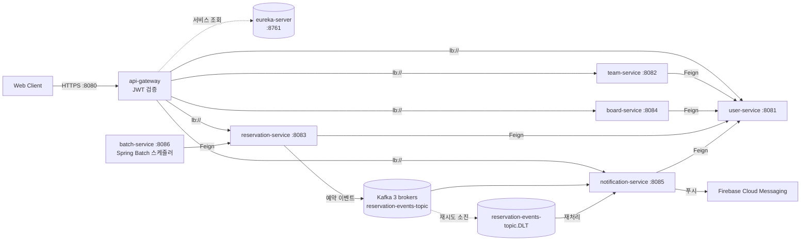

# Crane Web Backend v3

> 밴드 동아리 크레인의 예약 서비스 백엔드 — MSA(마이크로서비스 아키텍처) 기반 v3

---

## 📋 목차

1. [프로젝트 설명](#1-프로젝트-설명)
2. [개발자 정보](#2-개발자-정보)
3. [기술 스택](#3-기술-스택)
4. [아키텍처](#4-아키텍처)
5. [설계 특이사항](#5-설계-특이사항)
6. [프로젝트 구성](#6-프로젝트-구성)
7. [설치 및 실행 방법](#7-설치-및-실행-방법)
8. [API 명세](#8-api-명세)
9. [참고 및 출처](#9-참고-및-출처)
10. [버전 및 업데이트 정보](#10-버전-및-업데이트-정보)
11. [FAQ](#11-faq)

---

## 1. 프로젝트 설명

> 밴드동아리([CRANE](https://www.instagram.com/crane__sch/))에서 반복적으로 수기 처리하던 예약 과정을 자동화한 웹 서비스입니다.

- BE 2인, FE 1인이 진행 (개발 2024.06 ~ 2025.01 · 운영 2024.06 ~ 2025.12, 약 18개월)
  - **Frontend Repository:** [Crane_Web_Frontend_v2](https://github.com/CraneWebProject/Crane_Web_Frontend_v2)
- 18개월간 사용자 약 190명, 예약 약 1,700건
- 멘토링을 위한 장비·공간 예약, 합주를 위한 공간 예약, 동아리 활동 기록을 위한 게시판, 팀 관리 기능 구현

모놀리식 구조였던 v2를 도메인(사용자, 팀, 게시판, 예약, 알림, 배치)별 독립 서비스로 분리한 버전입니다. 서비스 위치는 **Spring Cloud Netflix Eureka**로 찾고, 외부 요청은 **Spring Cloud Gateway**가 받아 각 서비스로 라우팅합니다. 서비스 간 동기 호출은 **OpenFeign**을, 예약 알림은 **Apache Kafka** 이벤트를 사용합니다.

**주요 기능**
- 사용자 인증 및 권한 관리 (JWT + Spring Security)
- 팀 생성 및 관리
- 게시판·댓글 CRUD
- 장비·합주 예약
- 예약 알림 (Kafka 이벤트 + FCM 푸시)
- 예약 슬롯 일괄 생성·오픈 배치 (Spring Batch + 스케줄러)

---

## 2. 개발자 정보

| 이름 | 역할 | GitHub |
|------|------|--------|
| 명혜성 | 기획, 백엔드(예약·회원·알림·배치·MSA 전환·게이트웨이), 프론트엔드 전체, 인프라 전체 | [@Hyeseong-Myeong](https://github.com/Hyeseong-Myeong) |
| 송예림 | 백엔드(게시판 등 기능) | [@Yearm404](https://github.com/YerimSong404) |

---

## 3. 기술 스택

### Backend
| 분류 | 기술 |
|------|------|
| Language | Java 17 |
| Framework | Spring Boot 3.3 (batch-service 3.4), Spring Cloud 2023.0 (batch-service 2024.0) |
| Build Tool | Gradle (서비스별 독립 프로젝트) |
| ORM | Spring Data JPA |
| Batch | Spring Batch |
| Security | Spring Security, JWT (jjwt 0.11.5), BCrypt |
| 서비스 간 호출 | Spring Cloud OpenFeign |

### Database & Cache
| 분류 | 기술 |
|------|------|
| RDBMS | MySQL |
| Cache | Redis |

### Messaging
| 분류 | 기술 |
|------|------|
| Message Broker | Apache Kafka (Confluent Platform 7.8.0, 브로커 3대) |
| Coordinator | Apache ZooKeeper |
| Kafka UI | Kafka-UI (provectuslabs, v0.7.2) |
| Push | Firebase Cloud Messaging |

### Infrastructure & MSA
| 분류 | 기술 |
|------|------|
| Service Discovery | Spring Cloud Netflix Eureka |
| API Gateway | Spring Cloud Gateway |
| Container | Docker, Docker Compose |

### CI/CD & Automation
| 분류 | 기술 |
|------|------|
| CI/CD Pipeline | Jenkins (서비스별 Jenkinsfile) |
| 배포 방식 | Eureka 기반 블루그린 배포 (`deploy/bluegreen.sh`) |
| Notification | Slack (배포 상태 알림) |

---

## 4. 아키텍처


```mermaid
flowchart LR
    Client[Web Client] -->|HTTPS :8080| GW[api-gateway<br/>JWT 검증]
    GW -.->|서비스 조회| EU[(eureka-server<br/>:8761)]
    GW -->|lb://| US[user-service :8081]
    GW -->|lb://| TS[team-service :8082]
    GW -->|lb://| RS[reservation-service :8083]
    GW -->|lb://| BS[board-service :8084]
    GW -->|lb://| NS[notification-service :8085]
    TS & BS & RS & NS -->|Feign| US
    BA[batch-service :8086<br/>Spring Batch 스케줄러] -->|Feign| RS
    RS -->|예약 이벤트| K[(Kafka 3 brokers<br/>reservation-events-topic)]
    K --> NS
    K -.->|재시도 소진| DLT[(reservation-events-topic.DLT)]
    DLT -->|재처리| NS
    NS -->|푸시| FCM[Firebase Cloud Messaging]
```

- 모든 외부 요청은 api-gateway가 받아 JWT를 검증한 뒤, Eureka에 등록된 서비스로 라우팅합니다(`lb://서비스명`).
- DB가 필요한 서비스는 MySQL을 사용합니다.
- Redis는 두 곳에서 씁니다. user-service는 리프레시 토큰을 저장하고, api-gateway는 로그아웃된 토큰(블랙리스트)을 거릅니다.

### 서비스별 역할

| 서비스 | 포트 | 설명 |
|--------|------|------|
| api-gateway | 8080 | 외부 요청의 단일 진입점. JWT 검증과 라우팅 |
| eureka-server | 8761 | 서비스 레지스트리. 각 서비스의 위치를 등록·조회 |
| user-service | 8081 | 회원가입, 로그인, JWT 발급, 사용자 정보 관리 |
| team-service | 8082 | 팀 생성·수정·삭제, 팀원 관리 |
| reservation-service | 8083 | 장비·예약 관리, 예약 확정/취소 이벤트 발행 |
| board-service | 8084 | 게시글·댓글 CRUD |
| notification-service | 8085 | 예약 이벤트를 구독해 FCM 푸시 발송, FCM 토큰 관리 |
| batch-service | 8086 | 스케줄에 따라 예약 슬롯 생성·오픈 (reservation-service를 Feign으로 호출) |

---

## 5. 설계 특이사항

### 5-1. MSA 전환 (v2 → v3)
단일 애플리케이션을 도메인별 서비스로 분리했습니다. 각 서비스는 독립된 Gradle 프로젝트이고, 자체 Dockerfile과 Jenkinsfile을 가지고 따로 배포됩니다.

### 5-2. JWT 기반 Stateless 인증
- user-service가 JWT를 발급합니다.
- api-gateway가 요청마다 토큰을 검증합니다. 이때 Redis 블랙리스트에 있는(로그아웃된) 토큰은 거부합니다.
- 인증은 게이트웨이에서 끝나므로, 개별 서비스는 인증을 다시 확인하지 않습니다.

### 5-3. 서비스 간 호출 보호

서비스 간 동기 호출(OpenFeign)은 아래 설정으로 한 서비스의 장애가 다른 서비스로 번지지 않게 합니다.

- 타임아웃: 연결 2초, 응답 5초 (team, board, reservation, notification)
- 서킷브레이커: 실패율 50%를 넘으면 열리고 30초 뒤 재시도합니다(resilience4j, 슬라이딩 윈도우 20)
- batch-service는 초기 적재 잡이 한 번의 호출로 8일치를 생성하므로 응답 타임아웃을 5분으로 둡니다

### 5-4. 예약 알림 메시지 신뢰성 (Kafka)

reservation-service가 예약을 확정하거나 취소하면 `reservation-events-topic`에 이벤트를 발행합니다. notification-service는 이 이벤트를 구독해 FCM 푸시를 보냅니다.

| 단계 | 동작 |
|------|------|
| 정상 처리 | 푸시 발송에 성공한 뒤에만 오프셋 커밋 (`MANUAL_IMMEDIATE`) |
| 일시 오류 | 1초 → 2초 → 4초 간격으로 3회 재시도 후 `reservation-events-topic.DLT`로 이동 |
| 재시도해도 소용없는 오류 | JSON 파싱 오류, FCM 토큰 없음 등은 재시도 없이 바로 DLT로 이동 |
| DLT 재처리 | 별도 컨슈머 그룹(`notification-dlt-group`)이 즉시 1회 + 1분 간격 3회 다시 처리 |
| 최종 실패 | 에러 로그를 남기고 넘어감. 메시지는 DLT 토픽 보존 기간 동안 남아 있어 Kafka UI에서 조회·재발행 가능 |

- DLT로 보낸 메시지의 오프셋은 즉시 커밋됩니다(`commitRecovered`). 그래서 재시작해도 같은 메시지가 DLT에 다시 발행되지 않습니다.
- **클러스터 구성:** 브로커 3대, 복제 수 3, `min.insync.replicas` 2, 파티션 3
- 이벤트는 `userId`를 키로 발행합니다. 그래서 같은 사용자의 알림은 같은 파티션으로 가고 순서가 유지됩니다.
- 프로듀서는 기본값인 `acks=all`을 사용합니다. 그래서 브로커 1대가 멈춰도 쓰기와 데이터가 유지됩니다.
- 이 설정은 자동 생성되는 토픽(DLT 포함)과 내부 토픽(`__consumer_offsets`)에도 적용됩니다.

### 5-5. 예약 슬롯 배치

batch-service가 아래 일정에 따라 reservation-service를 호출합니다. 슬롯은 08:00~23:30, 30분 간격으로 장비마다 하나씩 만들어집니다. 서비스 기동 시의 초기 적재는 8일치를 한 번에 만들며 약 2,500건 규모입니다.

| 시각 | 잡 | 동작 |
|------|------|------|
| 서비스 기동 시 | `createReservationJob` | 오늘부터 7일 뒤까지의 슬롯을 열린 상태로 생성 |
| 매일 23:00 | `createReservationNextWeekJob` | 8일 뒤 슬롯을 닫힌 상태로 생성 |
| 매일 00:00 | `openNextWeekEnsembleJob` | 7일 뒤 합주 슬롯 오픈 |
| 매일 12:00 | `openNextWeekInstJob` | 7일 뒤 장비 슬롯 오픈 |
| 매일 04:00 | `deleteReservationJob` | 지난 주(8일 전~7일 전) 구간에서 예약자가 없는 슬롯 삭제 |

- **청크 단위 트랜잭션**
  - 슬롯을 100건씩 나눠 별도 트랜잭션으로 저장합니다.
  - 한 청크가 실패해도 그 청크만 롤백되고, 앞서 저장된 청크는 커밋된 상태로 남습니다.
- **제로 오프셋**
  - 배치 기준 시각을 대상 날짜의 00:00:00.000(오프셋 0)으로 정규화해, 같은 날짜에 대한 실행과 같은 슬롯을 항상 같은 키로 식별하는 방식입니다.
  - No-Offset 페이징처럼 순번이나 실행 시각이 아니라 키 값으로 위치를 찾습니다.
  - 잡 수준: JobParameter로 실행 시각 대신 실행 날짜(`runDate`)를 씁니다. 그래서 같은 날 같은 잡은 같은 JobInstance가 되고, 이미 완료된 잡이나 실행 중인 잡은 다시 실행되지 않습니다.
  - 슬롯 수준: (장비, 슬롯 시각)이 이미 있으면 건너뜁니다. 그래서 실패한 잡을 같은 날짜로 다시 실행해도 남은 슬롯만 생성되고 중복은 생기지 않습니다.

### 5-6. 배포 (Jenkins + 블루그린)

각 서비스의 Jenkinsfile은 다음 순서로 동작합니다.
1. 해당 서비스 디렉터리에 변경이 있을 때만 파이프라인을 진행합니다.
2. `./gradlew clean build -x test`로 빌드하고 Docker 이미지를 만든 뒤 배포합니다.
3. 시작부터 성공·실패까지의 결과와 소요 시간을 Slack으로 보냅니다.

**블루그린 배포 (적용 범위: 내부 서비스 5개):** user, team, reservation, board, notification 서비스에 적용하며, `deploy/bluegreen.sh`가 수행합니다. 외부 진입점인 api-gateway와 eureka-server, batch-service는 뒤의 표처럼 재생성 방식이므로, 무중단은 내부 서비스 배포에 해당합니다.
1. 실행 중인 색(`<서비스>-blue`/`-green`)의 반대 색으로 새 컨테이너를 띄웁니다.
   - 호스트 포트는 blue가 기본 포트, green이 기본 포트+10000이며, `127.0.0.1`에만 공개합니다. 외부 요청은 게이트웨이를 통해서만 들어옵니다.
2. **헬스체크:** 새 인스턴스가 Eureka에 `UP`으로 등록될 때까지 최대 120초 기다립니다.
   - 실패하면 새 컨테이너만 제거하고 배포를 실패로 처리합니다. 기존 컨테이너는 계속 서비스합니다.
3. **트래픽 전환:** 새 인스턴스를 뺀 같은 서비스의 인스턴스를 `OUT_OF_SERVICE`로 바꿉니다.
   - 이후 게이트웨이의 서비스 목록 캐시가 갱신될 때까지 90초 기다립니다.
4. 기존 컨테이너를 종료하고 삭제합니다.

게이트웨이는 Eureka에 등록된 `UP` 인스턴스로만 라우팅하므로, 등록 상태만 바꿔도 트래픽이 새 컨테이너로 넘어갑니다.

**재생성 방식 서비스:** 아래 세 서비스는 기존 컨테이너를 교체합니다.

| 서비스 | 이유 |
|------|------|
| api-gateway | 외부 진입점(호스트 8080)이라 Eureka로 전환할 수 없음. 배포 중 게이트웨이가 기동하는 동안 짧은 중단이 있음 |
| eureka-server | 클라이언트가 고정 URL을 바라봄. 재시작 중에도 각 서비스는 캐시된 레지스트리로 계속 라우팅함 |
| batch-service | 외부 트래픽이 없고, 두 대가 겹치면 스케줄러가 이중 실행됨 |

### 5-7. 컨테이너 자원 제한

| 대상 | 메모리 | CPU | JVM 힙 |
|------|------|------|------|
| 애플리케이션 서비스 8개 | 512MB | 1.0 | 컨테이너 메모리의 60% (`-XX:MaxRAMPercentage=60.0`) |
| Kafka 브로커 (각각) | 1GB | 1.0 | 512MB |
| ZooKeeper | 512MB | 0.5 | 256MB |
| Kafka UI | 512MB | 0.5 | 기본값 |

- 모든 컨테이너는 `unless-stopped`(Kafka UI는 `always`) 정책으로 자동 재시작됩니다.
- Kafka와 ZooKeeper 데이터는 named volume에 보관합니다.

---

## 6. 프로젝트 구성

```
Crane_Web_Backend_v3/
├── .github/                  # 이슈·PR 템플릿
├── api-gateway/              # Spring Cloud Gateway
├── batch-service/            # 예약 슬롯 생성·오픈 배치
├── board-service/            # 게시판 도메인
├── deploy/
│   └── bluegreen.sh          # Eureka 기반 블루그린 배포 스크립트 (Jenkinsfile에서 호출)
├── eureka-server/            # Netflix Eureka Server
├── notification-service/     # 알림 도메인 (Kafka 컨슈머, FCM)
├── reservation-service/      # 예약 도메인 (Kafka 프로듀서)
├── team-service/             # 팀 도메인
├── user-service/             # 사용자·인증 도메인
└── docker-compose.yml        # ZooKeeper + Kafka 브로커 3대 + Kafka UI
```

각 서비스 디렉터리는 독립된 Gradle 프로젝트입니다. 자체 Gradle wrapper, `build.gradle`, `Dockerfile`, `Jenkinsfile`이 들어 있습니다.

---

## 7. 설치 및 실행 방법

### 사전 요구사항

| 항목 | 버전 |
|------|------|
| JDK | 17 |
| Docker | 20.x 이상 |
| Docker Compose | v2 (v1이면 `docker-compose --compatibility up -d`로 실행해야 자원 제한이 적용됨) |
| MySQL | 8.x |
| Redis | - |

### 환경 변수

각 서비스는 `application.yml`에서 아래 환경 변수를 읽습니다.

| 변수 | 사용 서비스 | 설명 |
|------|------|------|
| `HOST_IP` | docker-compose | Kafka 브로커가 외부에 알릴 호스트 IP (로컬은 `127.0.0.1`) |
| `EUREKA_URL` | 전 서비스 | Eureka 주소 (예: `http://localhost:8761/eureka/`) |
| `MYSQL_URL`, `MYSQL_USER`, `MYSQL_PASSWORD` | user, team, board, reservation, notification, batch | MySQL 접속 정보 (`MYSQL_URL`은 JDBC URL) |
| `REDIS_HOST`, `REDIS_PORT` | api-gateway, user, team, board, reservation | Redis 접속 정보 |
| `KAFKA_URL` | reservation, notification | Kafka 부트스트랩 서버 (예: `localhost:19092,localhost:19093,localhost:19094`) |
| `JWT_KEY` | api-gateway, user | JWT 서명 키. 두 서비스가 같은 값을 써야 함 |
| `SSL_PATH`, `SSL_PASSWORD` | api-gateway | PKCS12 키스토어 경로와 비밀번호 |
| `PATH_FCM_SERVICEACCOUNT` | notification | Firebase 서비스 계정 키 파일 경로 |

### 실행 방법

**1단계: 저장소 클론**
```bash
git clone https://github.com/CraneWebProject/Crane_Web_Backend_v3.git
cd Crane_Web_Backend_v3
git checkout msa
```

**2단계: Kafka 클러스터 실행**
```bash
HOST_IP=127.0.0.1 docker compose up -d
```
Kafka UI는 `http://localhost:8989`에서 확인할 수 있습니다. 인증이 없어서 `127.0.0.1`에만 열려 있으므로, 원격 서버에서 실행했다면 SSH 터널로 접속합니다.

**3단계: 서비스 실행 (순서 중요)**

Eureka Server → 각 서비스 → API Gateway 순으로 실행합니다. 각 서비스는 자기 디렉터리의 Gradle wrapper로 실행하며, 위 환경 변수를 먼저 설정해 둡니다.

```bash
# 1. Eureka Server
(cd eureka-server && ./gradlew bootRun)

# 2. 각 서비스 (별도 터미널)
(cd user-service && ./gradlew bootRun)
(cd team-service && ./gradlew bootRun)
(cd board-service && ./gradlew bootRun)
(cd reservation-service && ./gradlew bootRun)
(cd notification-service && ./gradlew bootRun)
(cd batch-service && sh ./gradlew bootRun)   # gradlew에 실행 권한이 없어 sh로 실행

# 3. API Gateway (SSL 키스토어 필요)
(cd api-gateway && ./gradlew bootRun)
```

batch-service는 Spring Batch 메타 테이블이 DB에 미리 있어야 합니다(`spring.batch.jdbc.initialize-schema: never`).

**실행 확인**
- Eureka Dashboard: `http://localhost:8761`
- API Gateway: `https://localhost:8080`
- Kafka UI: `http://localhost:8989`

### 테스트

외부 인프라 없이 실행되는 테스트입니다. reservation-service 테스트는 H2 인메모리 DB를 사용합니다.

```bash
(cd notification-service && ./gradlew test --tests '*FcmServiceTest' --tests '*ReservationEventConsumerTest' --tests '*KafkaConsumerConfigTest')
(cd reservation-service && ./gradlew test --tests '*ReservationChunkTest')
(cd batch-service && sh ./gradlew test --tests '*ReservationBatchSchedulerTest')
```

| 테스트 | 확인 내용 |
|------|------|
| `FcmServiceTest` | FCM 발송 실패와 토큰 부재가 예외로 전파됨 |
| `ReservationEventConsumerTest` | 처리에 성공했을 때만 ack함. 실패하면 예외가 전파되고 ack하지 않음 (DLT 리스너 포함) |
| `KafkaConsumerConfigTest` | 3회 재시도 후 DLT로 발행되고 오프셋이 커밋됨. 파싱 오류는 바로 DLT로 감 |
| `ReservationChunkTest` | 중간 청크가 실패해도 앞 청크는 커밋됨. 재실행하면 남은 슬롯만 채우고 중복은 없음 |
| `ReservationBatchSchedulerTest` | 같은 날 실행은 같은 JobParameters를 씀. 이미 완료된 잡은 건너뜀 |

각 서비스의 `*ApplicationTests`(contextLoads)는 MySQL, Kafka 등의 환경 변수가 있어야 통과합니다.

---

## 8. API 명세

API 문서: [https://docs.google.com/spreadsheets/d/1WuNa686kZHJU7AwaPtOPIfbmVdhjwxsyIvBdn9gxMmw/edit?usp=sharing](https://docs.google.com/spreadsheets/d/1WuNa686kZHJU7AwaPtOPIfbmVdhjwxsyIvBdn9gxMmw/edit?usp=sharing)

서비스별 기본 경로:

| 서비스 | 기본 경로 |
|--------|------|
| user-service | `/api/v1/users` |
| team-service | `/api/v1/team`, `/api/v1/member` |
| reservation-service | `/api/v1/reservations`, `/api/v1/instruments` |
| board-service | `/api/v1/boards`, `/api/v1/replys` |
| notification-service | `/api/v1/fcm` |

> 상세 요청·응답 스펙은 위 API 문서를 참고하세요.

---

## 9. 참고 및 출처

- [Spring Cloud 공식 문서](https://spring.io/projects/spring-cloud)
- [Spring for Apache Kafka 공식 문서](https://docs.spring.io/spring-kafka/reference/)
- [Spring Batch 공식 문서](https://docs.spring.io/spring-batch/reference/)
- [Apache Kafka 공식 문서](https://kafka.apache.org/documentation/)
- [Spring Security 공식 문서](https://docs.spring.io/spring-security/reference/)
- [Netflix Eureka GitHub](https://github.com/Netflix/eureka)
- [Kafka UI (provectuslabs)](https://github.com/provectus/kafka-ui)

---

## 10. 버전 및 업데이트 정보

| 버전 | 날짜 | 내용 |
|------|------|------|
| v3.0.0 | 2025/01 | MSA 구조로 전면 재설계. Kafka, Eureka, API Gateway 도입 |
| v2.x.x | 2024/11 | 초기 모놀리식 버전 |
| v1.x.x | 2024/06 | 최초 버전 |

> 세부 변경 이력은 [커밋 히스토리](https://github.com/CraneWebProject/Crane_Web_Backend_v3/commits/msa)를 참고하세요.

---

## 11. FAQ

**Q. 서비스 실행 순서가 왜 중요한가요?**
> Eureka Server가 먼저 떠 있어야 다른 서비스가 자신의 위치를 등록할 수 있습니다. API Gateway는 등록된 서비스 목록을 기준으로 라우팅하므로 마지막에 실행합니다.

**Q. `HOST_IP` 환경 변수는 왜 필요한가요?**
> Kafka 브로커는 컨테이너 밖에서 접속할 수 있도록 `EXTERNAL` 리스너에 호스트 IP를 알립니다. 로컬 환경에서는 `127.0.0.1`로 설정하면 됩니다.

**Q. Kafka 브로커 1대가 멈추면 어떻게 되나요?**
> 복제 수 3, `min.insync.replicas` 2이므로 남은 2대로 쓰기와 읽기가 계속됩니다. 2대가 멈추면 데이터 유실을 막기 위해 쓰기가 거부됩니다(`NotEnoughReplicasException`).

**Q. 로컬 실행 시 JWT 인증이 계속 실패합니다.**
> api-gateway와 user-service의 `JWT_KEY` 값이 같은지 확인하세요. user-service가 발급한 토큰을 api-gateway가 같은 키로 검증합니다.

---

<div align="center">

**Crane Web Project** · [GitHub Organization](https://github.com/CraneWebProject)

</div>
